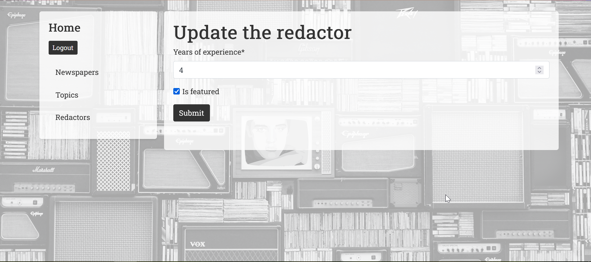

# Django Newspaper Agency

This is a Django web application that allows users to manage a simple newspaper agency. The application provides functionality for managing topics, newspapers, and redactors.

## Features

- User authentication (login/logout)
- CRUD operations for Topics, Newspapers, and Redactors
- Assigning redactors to newspapers
- Search functionality for list views
- Design using Bootstrap

## Check it out:

Installation

    Clone the repository to your local machine:
    git clone https://github.com/ykopatko/newspaper-agency.git

Navigate to the project directory:

    cd newspaper-agency

Create a virtual environment and activate it:

    python3 -m venv venv
    source venv/bin/activate

Run the Django migrations to set up the database:

    python manage.py migrate

Run the Django development server:

    python manage.py runserver

Login with the credentials:
    
        username: TestUser
        password: testpass1

Now, you can access the application at http://127.0.0.1:8000/ .

## Usage

- Navigate to the login page and log in with the credentials.
- Use the navigation menu to access the Topics, Newspapers, and Redactors list pages. 
- Use the search functionality on each list page to filter the results. 
- Create, update, and delete Topics, Newspapers, and Redactors using the provided buttons. 
- Assign redactors to newspapers by clicking the "Assign me to this newspaper" button on a newspaper's detail page. If already assigned, you can remove the assignment by clicking the "Delete me from this newspaper" button. 
- Access the Redactor detail page to see a profile with their assigned newspapers and other information.

## Customization

- To add custom images for topics, store the image files in the static/img/topic_images/ directory. Name the images according to the topic's name, like topic_name.jpg. The application will automatically display the corresponding images for each topic.

## Screenshots

### Login page: 

### Home1: 

### Home2: 

### Topic List: 

### Topic Search: 

### Topic Delete: 

### Newspaper list: 

### Newspaper Search: 

### Newspaper Update: 

### Newspaper Delete: 

### Newspaper Detail: 

### Newspaper assign Redactor: 

### Redactor List: 

### Redactor Detail: 

### Redactor Update: 